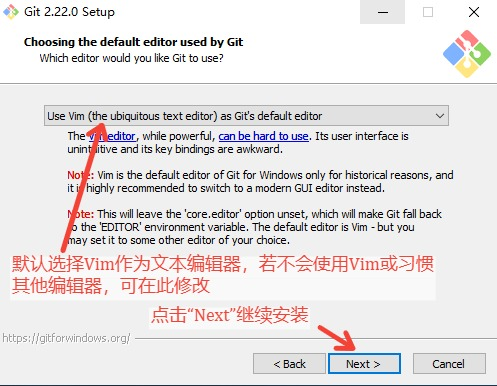

### 1.获取 Git for Windows 安装包
前往 [https://git-scm.com/download/win](https://git-scm.com/download/win) 获取安装包

 

### 2.打开下载好的安装包，启动安装程序，会显示如下内容（关于Git遵循的GPL协议），点击 “Next” 继续安装：

 

### 3.设置希望安装的目录，此处通过 “Browse...” 可以自行选择习惯的软件安装目录，选择好后点击 “Next” 继续安装：

 

### 4.勾选希望安装的组件，建议不要取消默认勾选的项目，若希望桌面有快捷图标，可以手动勾选 “Additional icons”（此项默认无勾选），然后点击 “Next” 继续安装：

 

### 5.选择是否创建开始菜单快捷方式，以及开始菜单中快捷方式所属的目录，若不希望创建开始菜单快捷方式，可勾选 “Don't create a Start Menu folder”（开始菜单快捷方式和桌面快捷方式建议至少二选一，以便快速打开Git），然后点击 “Next” 继续安装：

 

### 6.选择 Git 的默认编辑器（在提交修改时需要添加本次提交的注释，以解释本次提交的目的，此时需要用到文本编辑器），默认为 Vim，若不会使用 Vim或习惯其他编辑器，可在此处选择其他编辑器，如 Notepad++、Sublime、VS Code等等，选择完毕后点击 “Next” 继续安装：

 

### 7.选择安装 Git 时对环境变量PATH的影响，默认勾选中间项，建议不要修改，直接点击 “Next” 继续安装：

 

### 8.选择 Git 在使用 HTTPS 时使用的库，若无特殊需求，可保持默认选项，点击 “Next” 继续安装：

 

### 9.选择提交与拉取记录时，对换行符的处理方式[1](#annotation)，若无特殊需要，默认选择即可，点击 “Next” 继续安装：

 

### 10.选择模拟终端软件（即命令行窗口软件），若无特殊需要，可默认选择，点击 “Next” 继续安装：

 

### 11.几个额外选项，若无特殊需要，保持默认，点击 “Next” 继续安装：

 

### 12.最新功能的询问，若不想尝试尚未保证稳定性的新功能，默认不勾选，点击 “Install” 即可完成安装：

 

### 13.稍等一会儿，安装完毕后会显示如下内容，点击“Finish”完成安装：

 

 

### 14.若在第四步时勾选了 “Additional icons”，则安装后桌面会有一个名为 “Git Bash” 的快捷方式，可双击以打开 Git 的命令行（操作方式为 Unix/Linux 风格，而不是 Windows 的 Cmd 风格）：

 

### 15.若在第五步时没有选择 “Don't create Start Menu folder”，则在开始菜单的 Git 目录下也可以找到 Git Bash，以及 Git GUI（操作 Git 的图形工具）等其他工具：

 

### 16.以后即可通过 Git Bash 或 Git GUI 来使用 Git 了。
 
 

注释：

> 1\. “换行”在 Windows 和 Unix/Linux 下是不一样的，虽然编辑时都是敲击 Enter 以输入“换行”，但是在 Windows 环境下，一次换行实际上存储了两个字符：回车符（Carriage-Return）和换行符（Line-Feed），简称 CRLF，而在 Unix/Linux 环境下，一次换行就是一个字符：换行符（Line-Feed）。在 Unix/Linux 环境下用 Vim 打开带有 CRLF 的文本文件时，回车符 CR 会被显示为一个转角箭头。
