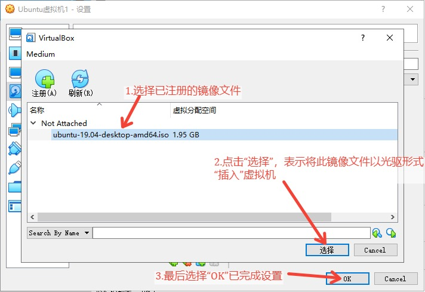
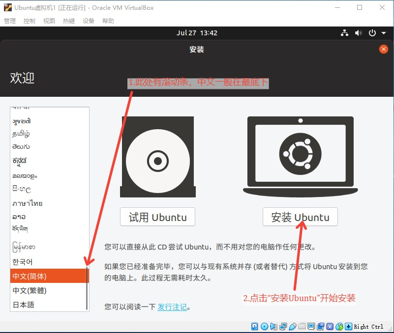

- ## [1.什么是操作系统](#1)
    - ### [1.1 硬件抽象](#1-1)
    - ### [1.2 系统调用](#1-2)
- ## [2.Linux 与 Linux发行版](#2)
- ## [3.安装 Ubuntu（Linux发行版之一）](#3)
    - ### [3.1 双系统安装](#3-1)
    - ### [3.2 虚拟机安装](#3-2)
        - #### [3.2.1 安装VirtualBox](#3-2-1)
        - #### [3.2.2 创建虚拟机](#3-2-2)
        - #### [3.2.3 安装Ubuntu](#3-2-3)
 
   

## 1.什么是操作系统
什么是操作系统？不同的人站在不同的角度会有不一样的回答，但是简单来说，操作系统就是一个工具，主要目的是为用户提供两种支持：硬件抽象、系统调用。

### 1.1 硬件抽象
所谓硬件抽象，就是指将具体的硬件抽象化，使用户无需关心硬件的细节，以方便用户对计算机进行操作。

最典型的例子就是硬盘，在 Windows 操作系统中，不论我们使用的是磁盘、SSD还是U盘，在资源管理器（即“我的电脑”）中，它们都是一样的概念：存储设备（C盘、D盘、E盘等等）。

假设我们的“C盘”是一块 SSD，“D盘”是一块磁盘，当我们从“C盘”复制一份文件到“D盘”时，我们只需要在“C盘”复制该文件，到“D盘”目标文件夹下粘贴即可，同理，从“D盘”复制一个文件到“C盘”也是一样的流程。

然而实际上，从 SSD 读取/写入数据和从磁盘读取/写入数据的实际过程是完全不同的，SSD 存储电场，磁盘存储磁场，两者的物理结构也不同[1](#annotation)。但是借助操作系统的硬件抽象支持[2](#annotation)，普通用户完全不用在意硬盘的区别就可以实现对硬盘内容的读写，类似的，用户也从来不需要关心鼠标的移动和屏幕上指针的移动是如何对应起来的。

 

### 1.2 系统调用
对于普通用户来说，系统调用是不容易接触到的，接触到系统调用支持的一般是应用程序的开发者，但是我们依然可以快速理解什么是系统调用支持。

举例来说，计算机联网的方式有很多种，普通网线、光纤、WiFi或者蜂窝网络都有可能，那么应用程序的开发者如何应对如此之多的联网方式的可能性，以确保不同用户使用自己开发的程序都能联网呢？答案是不用应对，借助操作系统提供的 Socket 编程接口（即系统调用），应用程序只需要关心自己希望连接的 IP、端口等参数即可。从这个角度来看，系统调用可以理解为面向开发者的硬件抽象。

> _因为应用程序在编写时会依赖系统调用的支持，因此若系统不提供应用程序需要的系统调用，那么应用程序就无法运行。这就是软件的下载页面会提示该软件需要在什么操作系统下运行的原因。_

当然，仅提供上述支持的，一般指操作系统的内核，人们实际安装、使用的“操作系统”，其实是内核 + 各种常用工具组成的“软件包”，比如 Windows 中的资源管理器、控制面板、计算器、画图、多媒体播放器等其实不是操作系统必备的，而是属于附带工具。但是，仅有操作系统内核的计算机，对于用户来说其实是无法使用的。

  

## 2.Linux 与 Linux发行版（Linux Distribution）
Linux 就是一个免费、开源的操作系统（内核），其历史悠久且复杂，因此我们在此只做简单介绍：曾经有一款优秀的、支持多用户和多进程的操作系统叫 UNIX，但是 UNIX 要收费，所以以 Richard Stallman 为首的许多人便成立了一个组织——GNU[3](#annotation)，其目标就是实现一个让所有人可以自由使用的、兼容 UNIX 的操作系统（不仅是内核，还包括工具），而这个 GNU 操作系统所使用的内核，就是 Linux —— 以 Linus Torvalds 为首的开源程序员们实现的一款操作系统内核。现在大家所使用的所谓 Linux 操作系统，实际上应该称作 GNU/Linux 操作系统，因为很多工具其实不属于 Linux 的范畴，而是 GNU。

但是即便是 GNU/Linux 操作系统，对于普通用户来说还是不够好用、不够有用，比如安装与管理软件很麻烦、没有图形操作界面等等，因此就有了 **“GNU/Linux发行版”** 的存在。GNU/Linux 发行版就是人们在 GNU/Linux 操作系统的基础上，添加了更多方便用户操作的功能、工具的操作系统，比如 CentOS 和 Ubuntu，前者采用了 yum 进行软件的安装和管理，而后者则采用了 apt。

如果不是极客，或者对 Linux 有刨根究底的兴趣、需求，一般安装 Linux 就是安装一个 GNU/Linux发行版。

  

## 3.安装 Ubuntu（GNU/Linux 发行版之一）
GNU/Linux 发行版多种多样，但是 Ubuntu 因为其友好的安装过程、图形操作界面以及“软件商店”，已经成为了普通用户中最为流行的 GNU/Linux 操作系统，并且大部分 Linux 软件都有针对 Ubuntu 环境的安装教程，因此将 Ubuntu 作为尝试 Linux 的第一步是较好的选择。下面我们就来看看如何为自己安装 Ubuntu。

> _安装其他流行的 GNU/Linux 发行版，如 CentOS、Debian等，流程都是类似的。_

首先，我们需要获取 Ubuntu 的镜像文件（ISO文件），其包含了 Ubuntu 以及 Ubuntu 安装程序。我们可以直接前往 Ubuntu 的官方网站获取：https://ubuntu.com/download/desktop （此链接为Ubuntu桌面版，目前最新版为19.04）

选择希望下载的版本后点击“Download”即可开始下载 Ubuntu 的镜像文件，假设我们下载19.04版本（18.04甚至16.04、14.04的安装过程基本一致，但是越旧的版本对机器性能的要求可能越低，下载旧版 Ubuntu 请前往 https://ubuntu.com/download/alternative-downloads）：

 

 

下载好 Ubuntu 的镜像文件后，下一步就是选择安装 Ubuntu 的方式——双系统或者虚拟机——然后安装Ubuntu。下载好的ISO文件如下图所示：

 

### 3.1 双系统
所谓双系统，就是指在一台计算机上安装两个操作系统，当开机时，通过选择（会有选择界面）以启动本次开机希望使用的操作系统。双系统的安装较为复杂，需要的前备知识也较多，因此不在此处进行介绍，详情请参考另一篇博客（若想要了解操作系统安装、启动的基本原理，也可阅读）：[暂未完成]()。

> _顺带一提，如果你知道如何安装双系统，那安装“单系统”就更简单了，因为双系统就是在已有一个操作系统的情况下，加装一个操作系统，而单系统就是直接“加装”一个操作系统。_

双系统的实用性其实很低，因为虽然计算机中有两个操作系统，但实际上一次只能使用一个，而且日后若不想使用双系统了，清除不想要了的那个操作系统也很麻烦，所以如果不是机器性能有限（比如内存 < 4GB）导致使用虚拟机有困难，又需要使用两个操作系统，不建议安装双系统。

 

### 3.2 虚拟机
所谓虚拟机，就是指借助软件（虚拟机软件）的帮助，创建一个虚拟的硬件环境，即虚拟机，然后在这个虚拟的硬件环境上安装操作系统和相应的软件，以模拟出另一台计算机。

所以安装虚拟机的步骤也很简单，就是三步：

1. 安装一个虚拟机软件，我们将在[3.2.1 安装VirtualBox](#3-2-1)讨论。
2. 通过虚拟机软件，创建一个虚拟机，我们将在[3.2.2 创建虚拟机](#3-2-2)讨论。
3. 在虚拟机中安装 Ubuntu，这一步和在实体机中安装 Ubuntu 几乎是一样的，因为对于虚拟机中的软件来说，它们就是运行在一台“实体机”上，这一步我们在[3.2.2 安装Ubuntu](#3-2-3)讨论。

使用虚拟机的好处有很多，比如创建、删除和移植都很方便，可以同时与本地（实际）操作系统运行，可以同时运行多台虚拟机等。这在只有一台实体机却想要模拟网络程序的运行，或者需要尝试某些软件却不想让其影响自己已有的软件环境时有很大帮助。

 

### 3.2.1 安装VirtualBox
比较知名的虚拟机软件有 VMware 和 VirtualBox，前者功能强大但是收费，后者功能不如前者丰富，但是开源、免费，而且使用起来更加简洁、方便。作为普通使用者，使用 VirtualBox 即可。下载 VirtualBox 可以直接前往其[官网](https://www.virtualbox.org)。

点击首页最显眼的按钮 “Download VirtualBox” 即可进入 VirtualBox 的下载界面：

 

 

对于本机操作系统为 Windows 的用户来说，点击 “Windows Hosts” 即可开始下载 VirtualBox 的安装包：

 

 

下载好安装包后，双击运行，然后一路点击 “下一步” 直至安装完成即可。若希望将 VirtualBox 安装至自己习惯的软件安装目录，只需在第二步中选择指定目录：

 

 

#### 3.2.2 创建虚拟机
正常安装完 VirtualBox 后，桌面会有 VirtualBox 的快捷方式（若无，前往安装目录寻找 VirtualBox.exe），双击打开 VirtualBox 后，按下图步骤操作，开始创建虚拟机：

> _若希望安装32位的 Ubuntu，则在“版本”处选择 Ubuntu（32bit），需要注意的是，Ubuntu自18.04版本开始不再提供32位系统，若需要32位 Ubuntu，请下载16.04版本或更早的14.04版本。_

 

 

第二步是设置虚拟机的内存大小，此处根据自身机器性能进行合理划分即可（对于 Ubuntu，建议不要低于1024MB），然后选择“下一步”：

 

 

第三步是为虚拟机创建一个虚拟硬盘（在本机中表现为一个文件），若没有已存在并打算直接使用的虚拟硬盘文件，此处选择默认项 “现在创建虚拟硬盘” 即可，然后点击 “创建” ：

 

 

第四步是选择新创建的虚拟硬盘文件的类型，三种格式 VirtualBox 都支持。其中 VDI 为默认选项，也是仅被 VirtualBox 支持的格式，VHD 是 Microsoft Virtual PC 支持的格式，VMDK 是由 VMware 所开发并支持的格式，但是 VirtualBox 和 QEMU（另一个虚拟机软件）都支持该格式[4](#annotation)。此处若无特殊需要，可默认选择 VDI，然后点击 “下一步”：

 

 

第五步是设置虚拟硬盘文件的属性：动态分配或固定大小。在下一步中我们会设置虚拟硬盘的大小，若此时设为固定大小，则虚拟硬盘文件会直接占据我们下一步所设置的空间大小，若此时设为动态分配，则虚拟硬盘文件会根据虚拟机实际使用情况动态变化虚拟硬盘文件的大小，但是上限是我们所设置的大小。设为动态分配较为节省空间，但是在虚拟机中进行硬盘操作时可能会比使用固定大小较慢。若无特殊需求，默认动态分配，然后点击“下一步”即可：

 

 

第六步是设置虚拟硬盘的大小，可根据自身机器性能和需求进行设置，若暂时不知道需要多少，可以在上一步选择动态分配，然后这一步设置一个较大的数值，设置好后点击 “创建”：

 

 

至此，我们就创建好一台虚拟机了，已创建的虚拟机位于左侧列表，对于已创建的虚拟机，我们可以选中后点击 “设置” 以修改其属性：

 

 

建议修改的设置如下：

 

 

 

 

 

#### 3.2.3 安装Ubuntu
虚拟机创建好了之后，接下来要做的就是将 Ubuntu 安装到虚拟机，更准确地说就是将 Ubuntu 安装到虚拟机的那块虚拟硬盘上，也就是说，如果你想要移植自己的一台虚拟机，只需要将该虚拟机使用的虚拟硬盘文件拷贝走便可。

为此，我们需要先在虚拟机设置页面将之前下载好的 Ubuntu 镜像文件 “插入” 到虚拟机的光驱上：

 

 

 

 

 

 

将镜像文件以光驱形式“插入”虚拟机后，即可打开虚拟机，开始正式安装 Ubuntu：

 

 

> _系统安装过程中会自动下载一些额外软件或新软件，如果不希望、不需要，或者想要尽可能快的安装完毕，可以在启动虚拟机前将主机的网络断开，比如拔掉网线，或在虚拟机设置处关闭虚拟机的网络连接，等虚拟机的操作系统安装完毕后，再联网。_

因为“插入”了 Ubuntu 的镜像文件，虚拟机启动后会自动执行镜像文件中的系统安装程序，我们可以在安装程序的第一步中设置系统默认语言，然后选择“开始安装Ubuntu”：

 

 

第二步是选择键盘布局（不同国家的键盘布局可能不同，比如德语键盘，有兴趣可以查一下），此处选择默认的汉语即可，点击“继续”：

 

 

第三步是选择安装模式，如果不需要像 LibreOffice 这样的附带办公软件，可以选择最小安装，如果想体验一下开源的各类办公、影音软件，可以选择正常安装，此处我们选择最小安装以尽快完成安装：

 

 

第四步是磁盘分区，如果不知道该如何进行磁盘分区，或者不需要磁盘分区，可以直接选择默认选项 “清除整个磁盘并安装Ubuntu”，然后点击 “现在安装”，再在弹出窗口中点击“继续”：

> _即便你是出于学习 Linux 系统管理的目的而安装 Linux，也无需此时就进行硬盘分区，因为对于虚拟机而言，添加一个新硬盘（虚拟硬盘）十分简单且廉价，你完全可以等熟悉了 Linux 操作后再临时插一块虚拟硬盘进行分区操作的学习。_

 

 

第五步是设置自己所在的地区，过于简单因此此处略过，来到第六步，设置用户名、计算机名、登陆密码等，设置完成后点击“继续”以进入实际安装过程：

 

 

安装进度条完毕后，会提示需要重启，点击“重新启动”即可：

 

 

重启后会提示 “Please remove the installation medium, then press ENTER”，意思是需要我们移除安装媒介——Ubuntu的镜像文件——然后按 Enter 键以开机：

 

 

> _默认情况下，重启后 VirtualBox 会自动移除插入了的镜像文件，若在“设备”-“分配光驱”中没有打勾了的ISO文件，则点击虚拟机界面，按 Enter 键继续即可。_

接着，我们就进入了 Ubuntu，其图形界面操作方式和 Windows 是基本相同的，如果想要打开命令行（Shell）的话，可以通过组合键 Ctrl + Alt + T。而在命令行中，通过组合键 Ctrl + Shift + T 则可以打开新的命令行窗口，类似于浏览器的标签页：

 

 

可以通过虚拟机软件的控制界面，即右上角的 × 进行关机，也可以通过虚拟机中的 Ubuntu 右上角的电源键中选择关机以关机。开机只需要在 VirtualBox 管理界面选中虚拟机，然后点击“启动”。

 

注释：
> 1\. 如果对SSD和磁盘的基本原理有兴趣，可以观看“回形针PaperClip”的科普视频：https://www.bilibili.com/video/av55918101

> 2\. 实际上还需要驱动程序的协作才行，操作系统通过驱动程序控制硬件，而驱动程序则既需要控制硬件，又需要符合操作系统对驱动程序的要求（比如提供操作系统指定的软件接口，像硬盘就肯定需要提供“read”接口）。缺乏对应驱动程序，从而导致硬件功能或部分硬件功能不能使用，也是很多人遇到过的问题。

> 3\. GNU的创立宣言：https://www.gnu.org/gnu/manifesto.html

> 4\. VDI、VDH、VMDK的区别参考自：https://superuser.com/questions/360517/what-disk-image-should-i-use-with-virtualbox-vdi-vmdk-vhd-or-hdd
